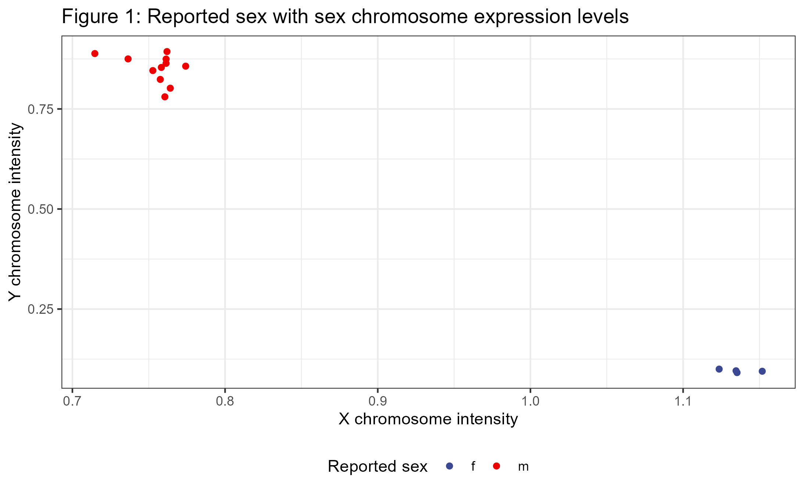
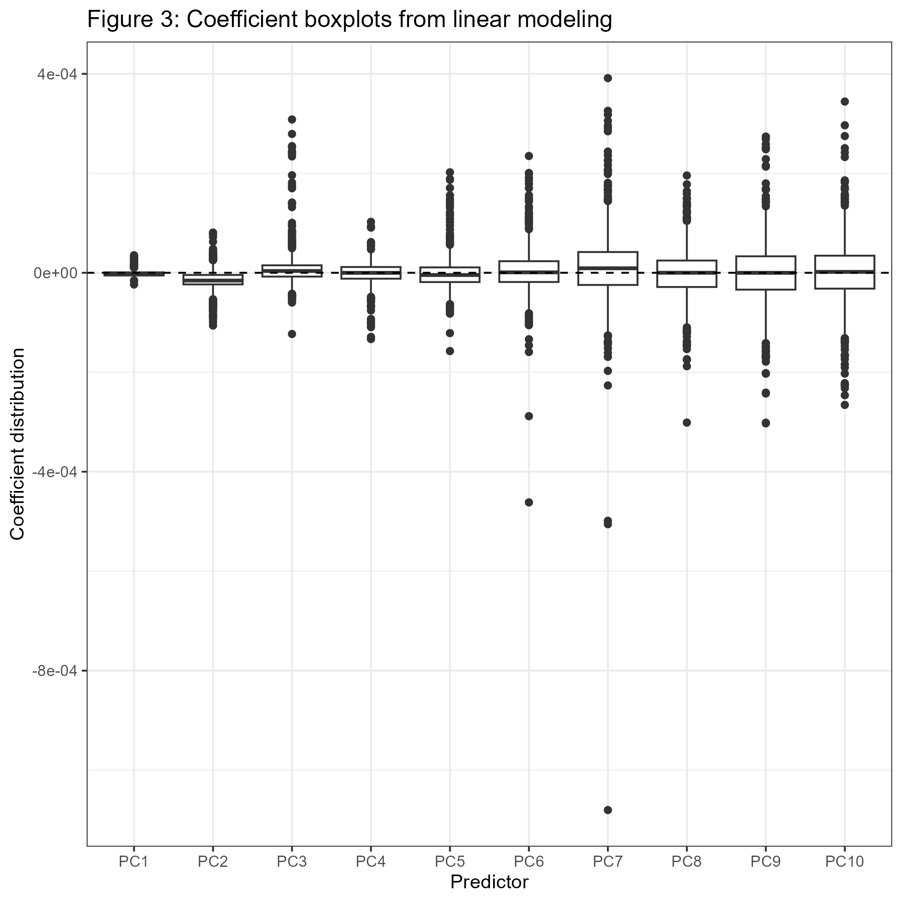

```{r setup, include=F}
knitr::opts_chunk$set(echo = TRUE, cache = F)

library(tidyverse)
library(data.table)
library(ewastools)
library(ggsci)
library(gt)
library(matrixStats)
library(DT)

theme_set(theme_bw())
```

# Introduction

From prior work experience I had learned of DNA methylation expression data. I do 
not have much of any experience with publically available data and thought that investigating 
the relationship between quality control measures and expression data could provide 
useful experience in web scraping, data wrangling, and data analysis. There
are numerous quality control measurements as part of expression data and I thought
that an interesting question could be to explore machine learning approaches to
predicting methylation expression levels from the QC data. Several normalization 
and adjustment methods (including at least one popular one that included Professor Irizarry
as a coauthor)
to correct for technical artifacts in DNAm have been published already that use
these 'control probes' (Triche et al. 2013). A set of technical replicate sample pairs were 
downloaded from the publically available Gene Expression Omnibus data (GEO) 
data repository (Tan et al. 2014). There is the potential that this machine
learning approach can be used for normalization in a manner similar to the aforementioned
packages or for imputation in a manner such as knn imputation. Taking the project
to that conclusion is beyond the scope of what I will be able to do for this 
class but I am planning to continue on in the future to make an attempt at this normalization and imputation.
At this point in the project I will look at linear regression to use principal
components from control probe expression to predict mean centered expression
values for various probes. This was chosen as it forms a good stepping stone before
delving into more complicated methodologies. The future aims will include a variety of more 
advance machine learning approaches.
As part of data wrangling and exploratory data analysis QC information from 
this expression data was compiled into a data table (Table 2) and quality control
checks such as principal component analysis against technical artifacts like plating
(Figure 2) were investigated.
In summary, the general motivating question behind this project is whether
machine learning applied to DNAm quality control metrics can be useful in predicting,
imputing, and normalizing expression data. 


# Results 

Data were aggregated from 'scratch' from a public repository GEO [Gene Expression
Omnibus](https://www.ncbi.nlm.nih.gov/geo/). A set of data on Danish twins was chosen
and 15 samples were downloaded from the website (Tan et al. 2014). This dataset
was chosen because it has readily available 'raw' files (idats) which include 
non preprocessed expression data which was necessary for this report. The 15 samples
reflected samples for which there were technical replicates which can facilitate 
assessment of normalization efficacy in how similar the expression data of the 
pairs becomes. Extensive data wrangling was necessary to identify the technical replicates,
download their data, acquire phenotype information (just on self reported sex for QC),
and to preprocess the methylation data. Web scraping from the series website (Image 1)
involved reading lines from the html page with __htmltools__ and searching for regex
matches to underline followed by letters A-E which were used to mark technical replicate 
pairs. The GSM ID for these samples was extracted, saved to an initial data table (Table 1), and looped
through downloading via ftp the appropriate .idat files. For a QC step involving
checking reported and DNA methylation sex the __readLines__ function was used
for each of the samples html page and regex was used to extract the reported sex. 

Quality control for the expression data primarily followed the pipeline set up
by the authors of the __ewasools__ package (Heiss & Just 2018). Raw idats were 
read in with the __read_idats__ function. Reported sex was compared to DNA
methylation expression levels from the sex chromosome probes with intent
to identify possible misplates of which there were none (Figure 1). Technical noise in 
background signal was assessed with a metric known as *Detection P* which showed
reasonable quality of assay for all samples. Sample cell proportion estimates and principal
components of expression data were created to explore primary sources of variation 
in the expression data (Figure 2) and quality control information was summarized
for each sample and finally, expression data was converted to a log-transformed 
state for use in the coming analyses.

The analysis performed looked at using a linear regression model to predict
DNA methylation expression. Expression data was mean centered across samples
and therefore the outcome was degree of increase or decrease in methylation as
compared to the average across samples. For reasons memory primarily as well 
as limited availability of technical replicate samples, there were 
only 15 samples included in the analysis and therefore the dimensions of predictors
were cut down. A total of 2550 methylation probes were put into principal component
analysis with the first 10 components being used as predictors. Since there are
over 400,000 different sites to look at a random sample of 1000 methylation sites
was selected for purposes of computation time and memory space, 
and the outputs of the linear model on each site was compared. PCs
1, 2, and 5 all had consistently negative effects on mean centered methylation, 
with PCs 3, 6, 7 having consistently positive effects as assessed with t-tests (Figure 3). 
R squared values were far higher than expected with the 10 PCs of the control
probes with 950 (95%) of the sites showing an r-squared value of >= 0.59 (Figure 4). 
The RMSE also fared up favorably and was quite small with the average standard
deviation of the fitted values being 0.39 and the average of the room mean
squared errors being 0.14 (Figure 5)

# Conclusion

In short, the low RMSEs and high R squareds provide promising initial feedback
on the merit of this project. The aim was to investigate the relationship
between quality control metrics from DNA methylation microarrays, and the expression
levels of the samples. The public dataset GEO was accessed for a set of technical
replicate pairs. Exploratory data analysis and quality control revealed no major 
issues in the underlying data. A log transformed and sample mean centered expression
matrix was created and expression levels were predicted from principal components
of quality control metrics. Given the success of the linear modeling there is
good merit in continuing the project while addressing some limitations of the current
methods and data. First, a higher sample count will be helpful for statistical power. 
Second, with greater analysis time it will be possible to look at all 485,000 
methylation sites rather than a random sample of 1000 of them. Third, more advanced
machine learning methods such as knn, random forest, and neural networks may 
provide even better predictive power. Fourth, the utility of this approach in
normalization and imputation can be assessed through both minimizing technical replicate
error rates and perhaps improving the predictive power of poly-epigenetic scores. 

# Appendix

## Figures


**Table 1: Initial sample information data table**


```{r, echo = F, eval = F}
d <- fread("origdat.csv") 
gt(d) %>% gtsave("odatsc.png", vwidth = 1000, vheight = 13000)
```

  

 

**Table 2: Quality control augmented sample data table**


```{r, echo = F, eval = F}
pd <- fread("pdqc.csv") 
gt(pd)
```




## Code{.tabset}

```{r, eval = T, echo = F}
knitr::opts_chunk$set(eval = F, echo = T)
```

### Data Acquisition

```{r get data together}
url <- "https://www.ncbi.nlm.nih.gov/geo/query/acc.cgi?acc=GSE61496"
l <- read_html(url)
l <- l %>% html_text %>% str_split("\n") %>% unlist
idx <- str_detect(l, "_[A|B|C|D|E]") %>% which

dat <- data.table(
  id = l[idx - 1],
  num = l[idx]
)

dat[, c("num", "orig") := tstrsplit(num, "_")]
setkey(dat, num)
fwrite(dat, "origdat.csv")

gt(dat) %>% gtsave("origdat.png")
```

```{r get idats}
if(!dir.exists("idats")){
  dir.create("idats")
}

#Where this series is located
repourl <- "https://ftp.ncbi.nlm.nih.gov/geo/samples/GSM1506nnn/"

if(length(list.files("idats")) < dat[, 2*length(id)]){ #A tiny bit hackish control flow
  for(i in dat[, id]){
  #Need to grab more info on name of sample to download
    ftplines <- paste0(repourl, i, "/suppl/") %>% readLines() 
  
  #Get red and green idat file locations
    idatnames <- ftplines[str_detect(ftplines, "\\.idat\\.gz")] %>% tstrsplit('\\"', keep = 2) %>% unlist
      paste0(repourl, i, "/suppl/", idatnames[[1]]) %>% 
      download.file(destfile = paste0("idats/",idatnames[[1]]))
    
      paste0(repourl, i, "/suppl/", idatnames[[2]]) %>% 
      download.file(destfile = paste0("idats/",idatnames[[2]]))
  }
}
```

```{r, eval = F}
s <- readLines("https://www.ncbi.nlm.nih.gov/geo/query/acc.cgi?acc=GSM1506327")
biosex <- map(dat[, id], function(acc){
  readLines(paste0("https://www.ncbi.nlm.nih.gov/geo/query/acc.cgi?acc=", acc)) %>%
  str_extract("sex, 1=m, 2=f: \\d") %>%
  .[!is.na(.)] %>% 
  str_split("") %>% 
  unlist() %>% 
  tail(n=1)
})

dat[, sex := c("m", "f")[unlist(biosex) %>% as.numeric]]

fwrite(dat, "samplesheet.csv")
```

### Quality control

```{r load in data}
dat <- fread("samplesheet.csv")

if(!dir.exists("pp")){
  dir.create("pp")
}
```

```{r read in idats, warning = F}
if(!file.exists("pp/meth.rds")){
  idats <- list.files("idats/", full.names = T, pattern = "\\.idat.gz$") %>%
    str_remove("_(Grn|Red)\\.idat\\.gz") %>%
    unique 

  indmatch <- match(dat[, id], idats %>% str_extract("GSM[\\d]*"))
  idats <- idats[indmatch]

  meth <- read_idats(idats) %>% detectionP
  stopifnot(dat[, id] == str_extract(meth$meta$sample_id, "GSM[\\d]*"))
  saveRDS(meth, "pp/meth.rds")
}
```

```{r preprocess}
#Get SNP probes for genotyping
meth <- readRDS("pp/meth.rds")
mani <- ewastools:::manifest_450K
snps <- mani[probe_type == "rs", probe_id]
geno <- call_genotypes(meth %>% mask(0.01) %>% dont_normalize %>% .[snps,])

dat[, c("x", "y") := check_sex(meth)]

dat[, missing := colMeans(meth$detP, na.rm = T)]

dat[, u := colMedians(meth$U, na.rm = T) %>% log2]
dat[, m := colMedians(meth$M, na.rm = T) %>% log2]
```

```{r check reported sex}
ggplot(dat, aes(x = x, y = y, color = sex)) +
  geom_point(size = 1.5) +
  labs(x = "X chromosome intensity", y= "Y chromosome intensity", color = "Reported sex",
       title = "Figure 1: Reported sex with sex chromosome expression levels") +
  theme(legend.position = "bottom") +
  scale_color_aaas()

ggsave("sexcheck.png")
```

```{r methylation intensity}
ggplot(dat, aes(x = m, y = u)) +
  geom_point() + 
  labs(x = "Methylated intensity", y = "Unmethylated intensity",
       title = "Median intensities on log2 scale")
```

```{r detp fail}
ggplot(dat, aes(x = missing)) +
  geom_histogram(color = "black", fill = "grey", bins = 4) +
  labs(x = "Average probe failure for sample")
```

```{r genotype agreement}
check_snp_agreement(geno, dat[, num], dat[, id])
```

```{r get beta}
beta <- meth %>% dont_normalize()
```

```{r cell type proportions}
cells <- estimateLC(beta, ref = "Salas")
cellpc1 <- prcomp(cells)$x[, 1]
dat[, cellpc := cellpc1]
```

```{r pcs on beta}
whichna <- which(is.na(beta), arr.ind = T)
beta[whichna] <- rowMeans(beta, na.rm = T)[whichna[, 1]]
pcs <- beta %>% t %>% prcomp
dat <- data.table(dat, pcs$x[, 1:5])
```

```{r plot pcs}
ggplot(dat, aes(PC1, PC2, 
                color = cut(cellpc1, 3) %>% as.factor %>% as.integer %>% as.factor)) +
  geom_point() +
  labs(color = "Tertile of cell PC") +
  theme(legend.position = "bottom") +
  scale_color_aaas()
```

```{r pcs with slide}
dat[, slide := tstrsplit(colnames(beta), "_", keep = 2)]

ggplot(dat, aes(x = PC1, y = PC2, color = as.factor(slide))) +
  geom_point() +
  labs(color = "Slide", title = "Figure 2: Principal components of expression data with sample slide") +
  scale_color_aaas()

ggsave("pcs_by_slide.png")
```

```{r save dat}
fwrite(dat, "pdqc.csv")
```

### Analyses

```{r load data}
dat <- fread("pdqc.csv")
meth <- readRDS("pp/meth.rds")
```

```{r matrix of predictors}
# Predictor matrix to perform PCA on
xmat <- do.call("rbind", list(meth$ctrlG, meth$ctrlN, meth$ctrlR)) %>% t
colnames(xmat) <- c(paste0("ctrlg", 1:850), paste0("ctrln", 1:850), paste0("ctrlr", 1:850))
missmat <- which(is.na(xmat), arr.ind = T)
xmat[missmat] <- rowMeans(xmat, na.rm = T)[missmat[, 1]]
xpc <- prcomp(xmat)

#M values for outcome
m <- meth %>% dont_normalize() %>% wateRmelon::Beta2M()
centm <- m %>% t %>% scale(scale = F) %>% t
```

```{r predict values}
set.seed(260)
irow <- sample(65:nrow(centm), size = 1000)
lmout <- list()
for(i in irow){
  lmout[[paste0("row", i)]] <- lm(y ~ ., data = data.table(y = centm[i,], x = xpc$x[, 1:10]))
}
```

```{r get coefficients}
coefdt <- map(lmout, ~coef(.x)[2:11]) %>% do.call("rbind", .) %>% data.table
colnames(coefdt) <- str_extract(colnames(coefdt), "PC\\d*")
coefdt <- melt(coefdt)

ggplot(coefdt, aes(x = variable, y = value)) +
  geom_boxplot() +
  geom_hline(linetype = "dashed", yintercept = 0) +
  labs(x = "Predictor", y = "Coefficient distribution", title = "Figure 3: Coefficient boxplots from linear modeling")
ggsave("coefficient_predictors.png")

#Only PC1/PC2 seems to have coefficients significantly different from 0 consistently
t.test(coefdt[variable == "PC1", value])
t.test(coefdt[variable == "PC2", value])

coefdt[, t.test(value), by = variable]
```

```{r get significance}
sigdt <- map(lmout, ~summary(.x)$coefficients[-1, 3]) %>% do.call("rbind", .) %>% data.table
colnames(sigdt) <- str_extract(colnames(sigdt), "PC\\d*")
sigdt <- melt(sigdt)

ggplot(sigdt, aes(x = variable, y = value)) +
  geom_boxplot() +
  geom_hline(lty = "dashed", yintercept = 0) +
  labs(x = "Predictor", y = "Test statistic distribution", title = "Figure 3: Coefficient boxplots from linear modeling")
ggsave("tstat.png")

# t.test(sigdt[variable == "PC1", value])
# t.test(sigdt[variable == "PC2", value])
sigdt[, t.test(value), by = variable]
```

```{r get r2}
r2 <- map(lmout, ~summary(.x)$r.squared) %>% data.table

ggplot(r2, aes(x = unlist(.))) +
  geom_histogram(bins = 20, color = "black", fill = "grey") +
  labs(x = "Multiple R2 values", title = "Figure 4: R squared values from linear modeling")
ggsave("rsq.png")

```

## References

Tan Q, Frost M, Heijmans BT, von Bornemann Hjelmborg J, Tobi EW, Christensen K, Christiansen L. Epigenetic signature of birth weight discordance in adult twins. BMC Genomics. 2014 Dec 4;15(1):1062. doi: 10.1186/1471-2164-15-1062. PMID: 25476734; PMCID: PMC4302120.

Timothy J. Triche, Jr, Daniel J. Weisenberger, David Van Den Berg, Peter W. Laird, Kimberly D. Siegmund, Low-level processing of Illumina Infinium DNA Methylation BeadArrays, Nucleic Acids Research, Volume 41, Issue 7, 1 April 2013, Page e90, https://doi.org/10.1093/nar/gkt090

Heiss, J., Just, A. Identifying mislabeled and contaminated DNA methylation microarray data: an extended quality control toolset with examples from GEO. Clin Epigenet 10, 73 (2018). https://doi.org/10.1186/s13148-018-0504-1

https://jhelvy.github.io/distillery/ -- For various helpful tips in the development of this website format.

